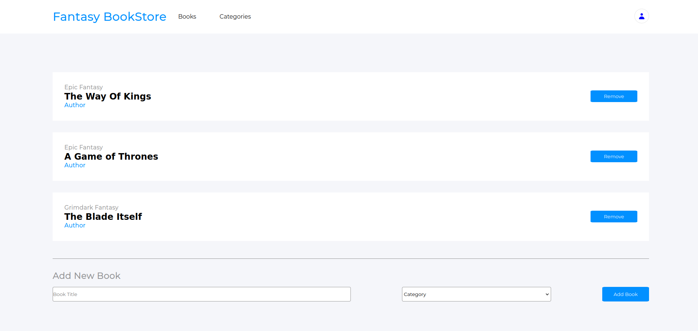

# Fantasy Bookstore

> "Fantasy Bookstore" is a website for Fantasy book fans. It is a bookstore which allows the user to interact with it in the following manner:
  - Add Books to a list.
  - Remove selected book.
  - Use of api to store the given response.
  By building this application, I will get my first experiance of React-Redux. 

## Built With

- Html, CSS, Javascript
- React, Redux, Thunk
- Webpack, Jest, Gitflow

## Live Demo

[Live Demo Link]()

## Getting Started

To get a local copy up and running in your machine:

    1.Clone this repo or download the zip folder:

      git clone https://github.com/Lockless404/dotaCapstone.git

    2.Navigate to the location of the folder in your machine:

      you@your-Pc-name:~$ cd <folder>

    3.Install all the dependencies:

      npm install

    4.Run app in your local browser:

      npm start

## Authors

👤 **Hamza Tarar**

- GitHub: [@Lockless404](https://github.com/Lockless404)
- Twitter: [@hamza_tarar10](https://twitter.com/hamza_tarar10)
- LinkedIn: [Hamza Tarar](https://www.linkedin.com/in/hamza-tarar-639685216/)

## 🤝 Contributing

Contributions, issues, and feature requests are welcome!

Feel free to check the [issues page](../../issues/).

## Show your support

Give a ⭐️ if you like this project!

## Acknowledgments

- Hat tip to anyone whose code was used
- Inspiration
- etc

## 📝 License

This project is [MIT](./MIT.md) licensed.
